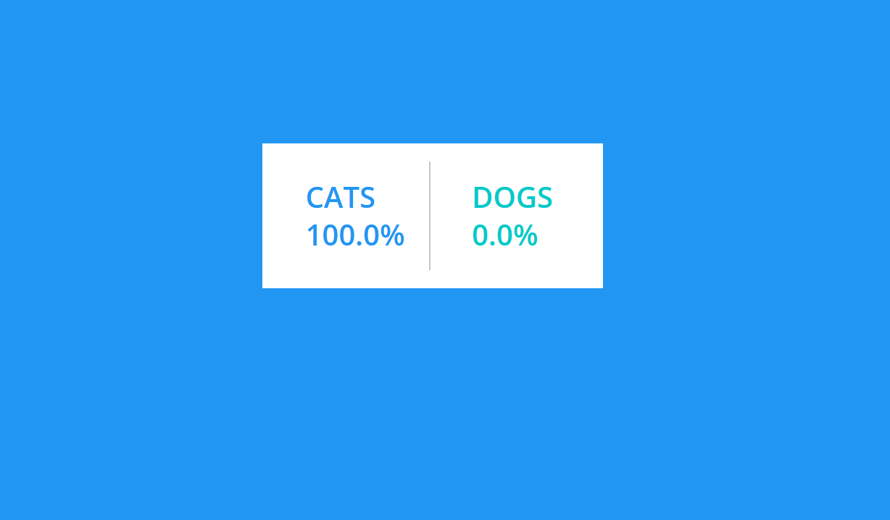
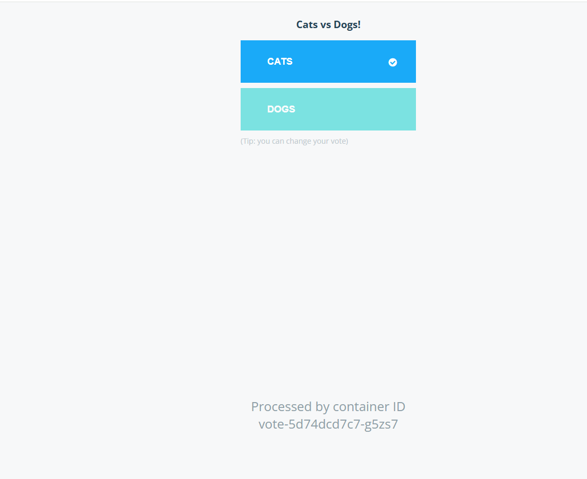
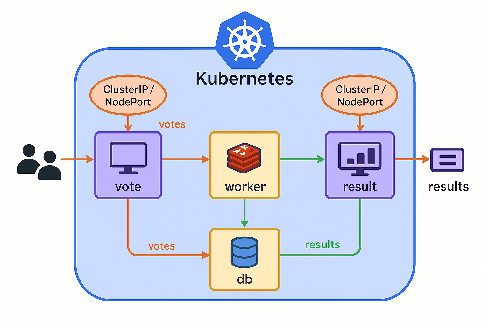

# Eval-cc Baptiste Ramos 

## Command

git clone https://github.com/dockersamples/example-voting-app.git

cd example-voting-app

sudo kubectl apply -f k8s-specifications/

sudo kubectl get pods

sudo kubectl get services

Les pods doivent être en status running

## Capture 

## Schéma infra

